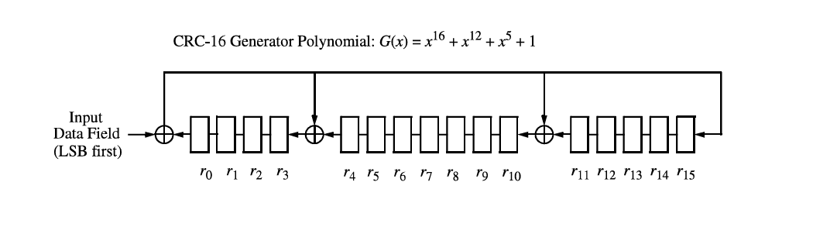
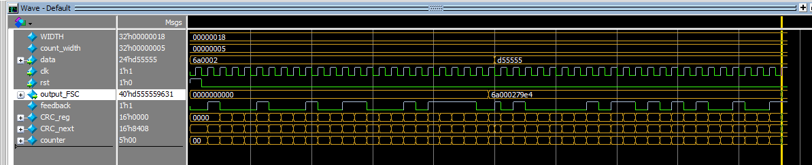

# 🛰️ CRC-16 (IEEE 802.15.4) Frame Check Sequence Generator

<p align="center">


</p>

---

## 📖 Overview

This project implements a **parameterizable CRC-16 Frame Check Sequence (FCS) Generator** in **Verilog HDL** according to the **IEEE 802.15.4** standard.

The design computes a **16-bit CRC** using a **Linear Feedback Shift Register (LFSR)** based on the generator polynomial:

> **G(x) = x¹⁶ + x¹² + x⁵ + 1**

The module processes the input data **LSB-first**, initializes the CRC register to **0x0000**, and generates the **Frame Check Sequence (FCS)** after all input bits are processed.

---

# ✨ Features

✅ Parameterizable input width

✅ IEEE 802.15.4 compliant

✅ CRC-16 Polynomial (0x1021)

✅ LSB-first processing

✅ Synthesizable RTL

✅ Clean combinational & sequential implementation

✅ Self-checking Testbench

✅ Simulation verified


# 🏗️ CRC Architecture

<p align="center">

</p>


# 🔬 Simulation Waveform

<p align="center">

</p>


# 📊 Verification Example

| Input Data | CRC |
|------------|-----|
| `24'h6a0002` | `16'h79e4` |
| `24'hd55555` | `16'h9631` |

---

# ⚙️ Project Structure

```text
CRC-16-FCS
│
├── RTL
│   └── FCS.v
│
├── TB
│   └── FCS_tb.v
│
├── Images
│   ├── crc_architecture.png
│   ├── simulation.png
│   └── waveform.png
│
├── Results
│   └── crc_vectors.txt
│
└── README.md
```

---

# 🚀 Getting Started

## Compile

```tcl
vlog RTL/FCS.v
vlog TB/FCS_tb.v
```

## Simulate

```tcl
vsim work.FCS_tb
run -all
```

---

# 🧪 Test Environment

- ✔️ ModelSim / QuestaSim
- ✔️ Verilog HDL
- ✔️ IEEE 802.15.4 Reference
- ✔️ RTL Simulation

---

# 📚 References

- IEEE Std 802.15.4-2011
- CRC-16 Generator Polynomial

```text
G(x) = x¹⁶ + x¹² + x⁵ + 1
```

---

# 👨‍💻 Author

### **Amr Hesham Awad Soliman**

🔹 Digital IC Design Engineer

🔹 RTL Design | Verilog HDL | FPGA

🔹 Digital Design Enthusiast

---

# ⭐ If you found this project useful...

Give it a ⭐ on GitHub!

Happy Coding 🚀